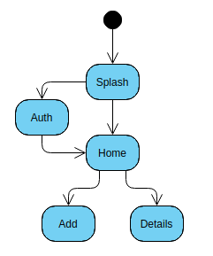

# Result

 | Init| Login |
 |-----------|-----------|
 || |
 | Login error| Empty list |
 || |
 | New item| Item list |
 || |
 

# Zadanie rekrutacyjne dla Utopia USS

## Cel

Celem zadania jest stworzenie aplikacji która pozwala użytkownikowi tworzyć i przeglądać zapisywane po stronie serwera
notatki składające się z nazwy, treści i/lub linka.

## Opis

W projekcie skonfigurowaliśmy Firebase (powinieneś dostać zaproszenie razem z tym zadaniem) i podstawową strukturę kodu.

Zadanie składa się zasadniczo z dwóch części: 
- stworzenia od zera warstwy widoków (5 ekranów)
- refactoru istniejącego kodu serwisów (który celowo ubrudziliśmy)
 
Masz wolną rękę jeśli chodzi o wygląd i stosowane narzędzia (w granicach Wymagań). Dla uproszczenia targetujemy tylko Android więc usunęliśmy katalog `ios` i możesz założyć że aplikacja będzie uruchamiana tylko na tym systemie. W ramach rozwiązania prześlij nam cały katalog projektu jako ZIP (możesz usunąć katalog `build` aby był lżejszy). W projekcie włączyliśmy też null-safety, więc pamiętaj o poprawnym typowaniu. Powodzenia!

## Wymagania

### Wymagania funkcjonalne

- Aplikacja musi działać na systemie Android.
- Użytkownik może zalogować się do aplikacji używając kombinacji email/hasło.
- Podanie nigdy wcześniej nie użytego adresu email tworzy nowego użytkownika z podanym hasłem.
- Aplikacji musi poprawnie obsługiwać błędy autoryzacji.
- Aplikacja musi pamiętać zalgowanego użytkownika między uruchomieniami.
- Aplikacja powinna wyświetlać **aktualizowane na bieżąco** wszystkie notatki zalogowanego użytkownika w kolejności od
  najnowszej. Widoczna powinna być conajmniej nazwa notatki.
- Użytkownik może być zalogowany jednocześnie na kilku urządzeniach.
- Użytkownik może stworzyć nową notatkę podając obowiązkowo nazwę oraz opcjonalnie treść i link.
- Użytkownik może zobaczyć szczegóły notatki (pełną treść, klikalny link) po kliknięciu w daną notatkę.

### Wymagania UI

- UI powinno być proste, ale schludne, płynne i funkcjonalne (nie stosuj ambitnych efektów jeśli nie służą one użyteczności aplikacji).
- UI powinno być po angielsku.
- Jest pełna dowolność jeśli chodzi o stosowane środki, o ile spełnione są wymagania funkcjonalne.
- Można korzystać ze standardowych stylów i komponentów Material Design.
- Wymagany jest następujący przepływ nawigacji:

### Wymagania techniczne

- **Wymagana jest czystość, czytelność i idiomatyczność kodu**.
- Można użyć dowolnej architektury (nasz zespół korzysta z hooków).
- Do autoryzacji należy użyć Firebase Auth, do przechowywania notatek Firebase Firestore korzystając z już
  skonfigurowanego projektu.
- Można dowolnie zmieniać istniejące fragmenty kodu, poza polami modelu Item (zarówno w kodzie jak i na backendzie)
- Można korzystać z dowolnych dodatkowych zewnętrznych bibliotek.
- Nie należy przejmować się paginacją notatek.
